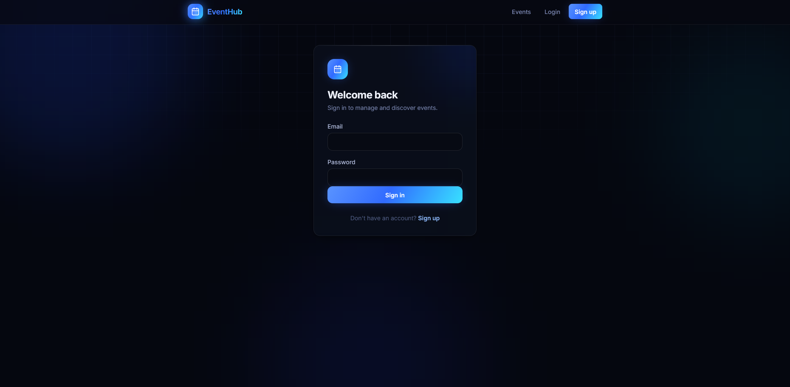
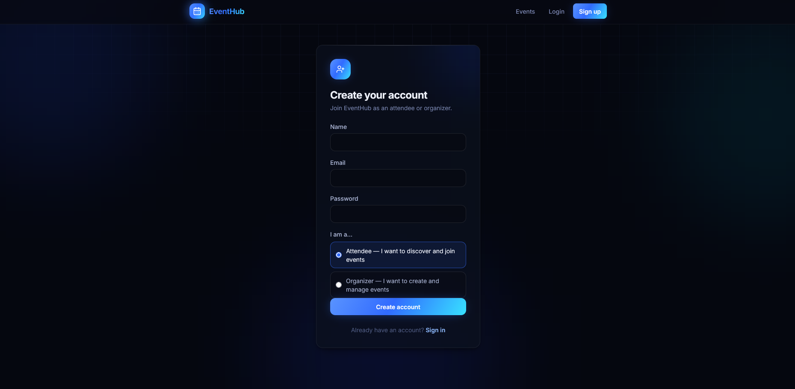
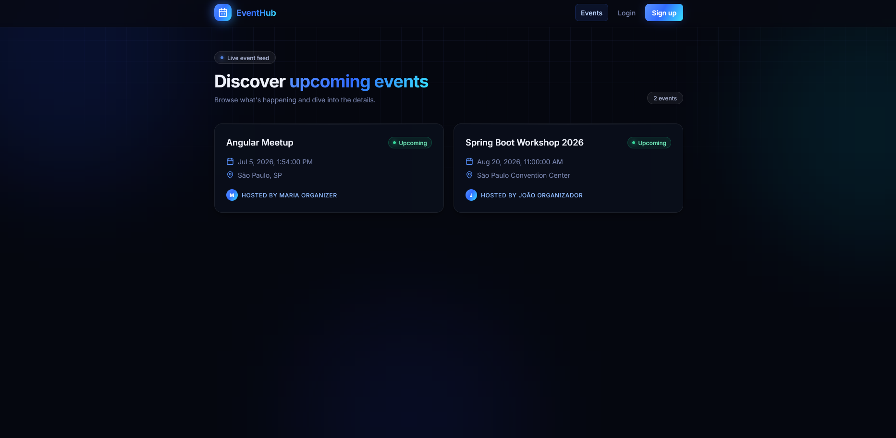
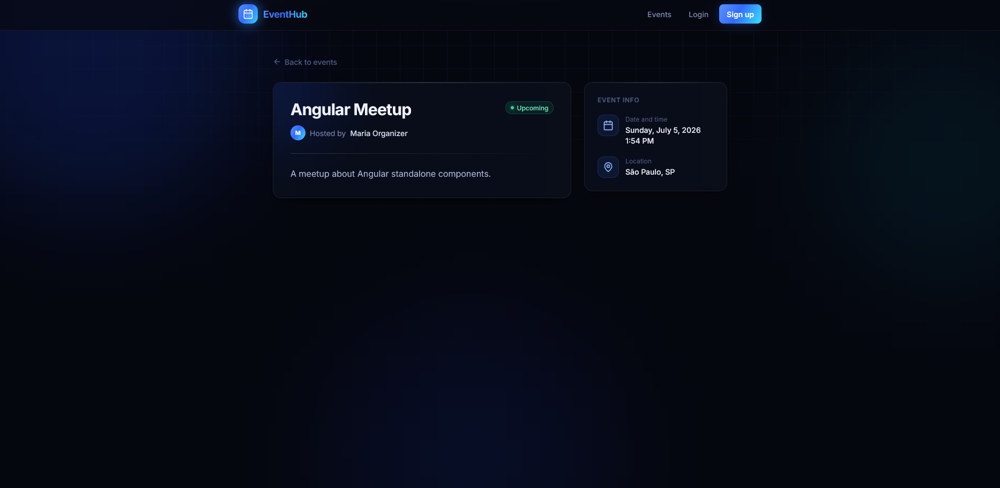
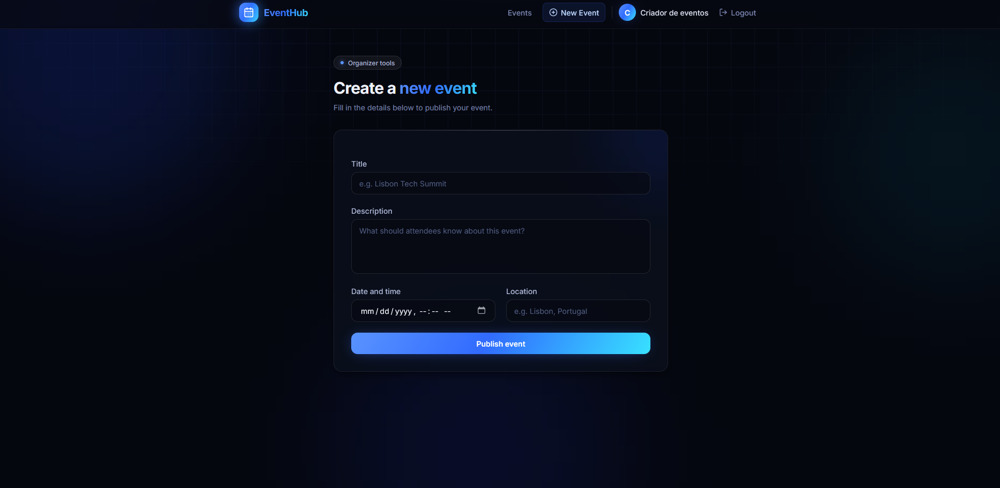

# EventHub Front

EventHub is an event management web app: users can register/login, browse and view events, and organizers can create and manage their own events. This is the Angular frontend, generated with [Angular CLI](https://github.com/angular/angular-cli) v19.2.27 and consuming a REST API (configured via `src/environments`).

## Tech stack

- **Framework:** Angular 19 (standalone components, lazy-loaded routes)
- **Language:** TypeScript 5.7
- **Styling:** Tailwind CSS 3 + PostCSS/Autoprefixer
- **Icons:** lucide-angular
- **Reactive state/HTTP:** RxJS, Angular `HttpClient`
- **Auth:** JWT access/refresh tokens, decoded client-side (`jwt.util.ts`) to derive the current user and role
- **Testing:** Karma + Jasmine

## How the app is built, step by step

1. **Bootstrap & config** — [app.config.ts](src/app/app.config.ts) wires up providers (router, HTTP client with interceptors). [app.routes.ts](src/app/app.routes.ts) defines the routes, all lazy-loaded with `loadComponent`.

2. **Core layer** (`src/app/core`) — cross-cutting concerns used across the app:
   - `models/` — TypeScript interfaces mirroring the API DTOs (`User`, `Event`, `LoginRequest`, `TokenResponse`, `JwtPayload`, etc.)
   - `services/` — `auth.service.ts` (login/register/refresh/logout), `event.service.ts` (CRUD for events), `user.service.ts`, and `jwt.util.ts` for decoding tokens
   - `guards/` — `auth.guard.ts` (route requires a logged-in user) and `organizer.guard.ts` (route requires the `ORGANIZER` role)
   - `interceptors/` — `auth.interceptor.ts` attaches the access token to outgoing requests and handles refresh

3. **Shared layer** (`src/app/shared`) — reusable building blocks: `button`, `badge`, `spinner`, and `navbar` components, plus `validators.util.ts`, `form-errors.util.ts`, and `date.util.ts` helpers used by forms across features.

4. **Feature layer** (`src/app/features`) — the actual screens:
   - `auth/login` and `auth/register` — authentication forms
   - `events/event-list` — public listing of events
   - `events/event-detail` — single event view
   - `events/event-form` — create/edit an event, restricted to authenticated organizers via the route guards

5. **Routing model** — `/` redirects to `/events`. `/events` and `/events/:id` are public. `/events/new` is protected by `authGuard` + `organizerGuard`. Unknown paths redirect to `/events`.

6. **API integration** — `environment.apiUrl` points to `http://localhost:8080/api` in development and `/api` in production, so the backend must be running and reachable at that URL for data to load.

## Screenshots

**Login page** (`/login`) — the auth form



**Register page** (`/register`) — sign-up flow, choosing attendee or organizer



**Event list** (`/events`) — public browsing view



**Event detail** (`/events/:id`) — single event page



**Event form** (`/events/new`) — logged in as an organizer, create/edit form



## Development server

To start a local development server, run:

```bash
ng serve
```

Once the server is running, open your browser and navigate to `http://localhost:4200/`. The application will automatically reload whenever you modify any of the source files. Note: the backend API (default `http://localhost:8080/api`, see `src/environments/environment.ts`) must be running for data-dependent pages to work.

## Code scaffolding

Angular CLI includes powerful code scaffolding tools. To generate a new component, run:

```bash
ng generate component component-name
```

For a complete list of available schematics (such as `components`, `directives`, or `pipes`), run:

```bash
ng generate --help
```

## Building

To build the project run:

```bash
ng build
```

This will compile your project and store the build artifacts in the `dist/` directory. By default, the production build optimizes your application for performance and speed.

## Running unit tests

To execute unit tests with the [Karma](https://karma-runner.github.io) test runner, use the following command:

```bash
ng test
```

## Running end-to-end tests

For end-to-end (e2e) testing, run:

```bash
ng e2e
```

Angular CLI does not come with an end-to-end testing framework by default. You can choose one that suits your needs.

## Additional Resources

For more information on using the Angular CLI, including detailed command references, visit the [Angular CLI Overview and Command Reference](https://angular.dev/tools/cli) page.
